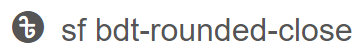
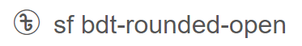
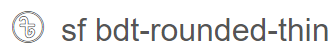
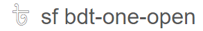
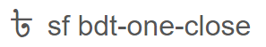
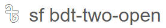
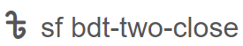
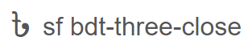

# Bangladeshi Taka Icon Like Font Awesome


## Installation CDN Link

```
https://cdn.jsdelivr.net/gh/Naimur2/Bangladeshi-Taka-Icon/style.css
```

---

## How to use

```
<i class="sf bdt-rounded-close"></i>
```

#### \*Default Font Size 3rem(48px)

## Classes



```
sf bdt-rounded-close
```



```
sf bdt-rounded-open
```



```
sf bdt-rounded-thin
```



```
sf bdt-one-open
```



```
sf bdt-one-close
```



```
sf bdt-two-open
```



```
sf bdt-two-close
```



```
sf bdt-three-open
```


```
sf bdt-three-close
```

### Created By: Naimur rahaman

##### Curtesy: Sohid Barkat Font | Nirmala Ui | Kalpurush ANSII
